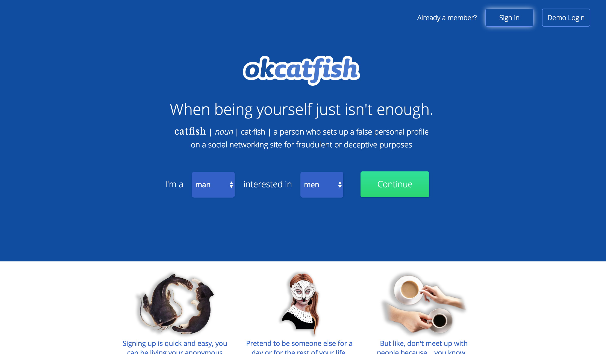
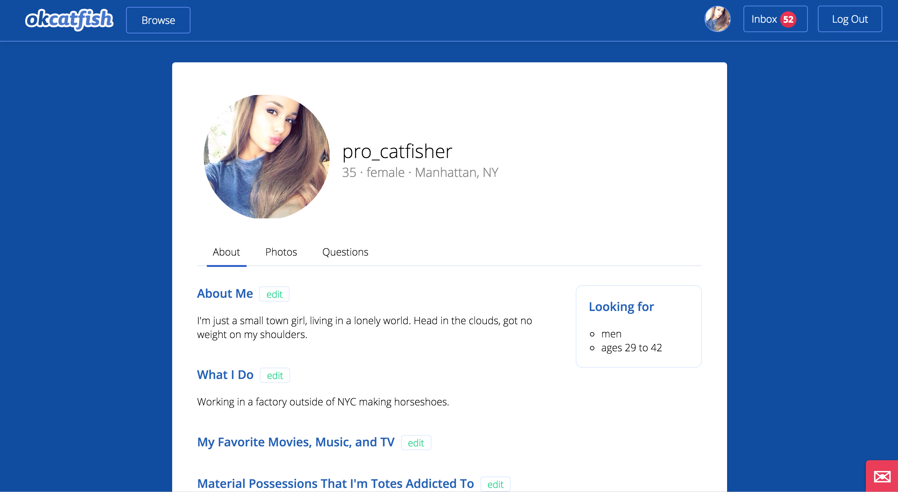
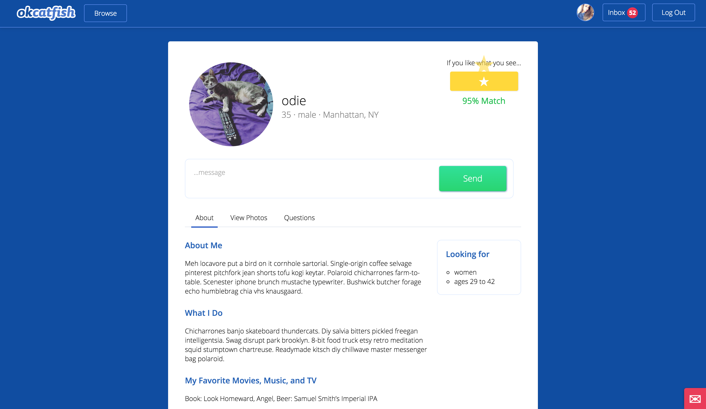
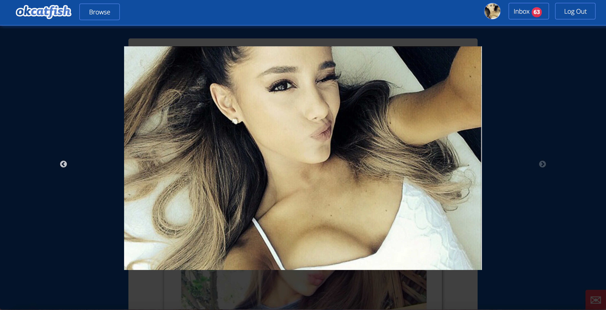
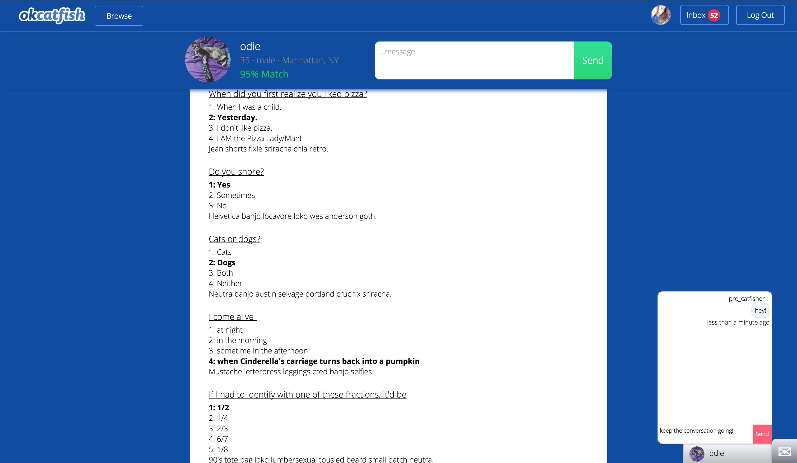
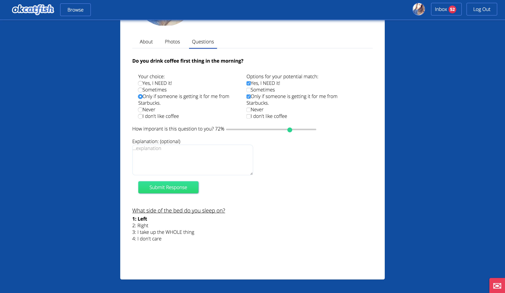
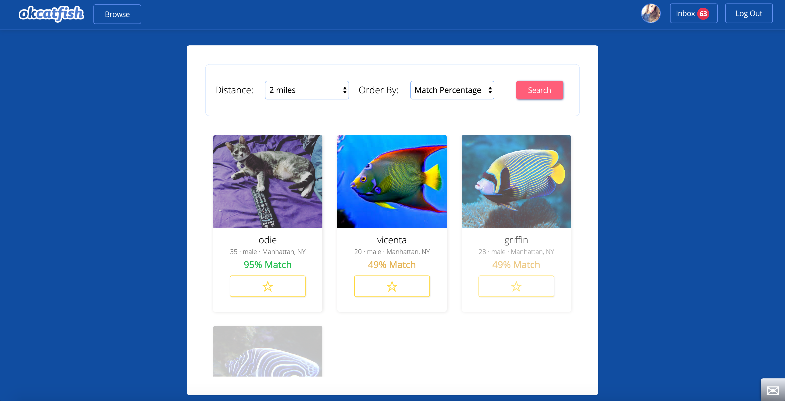
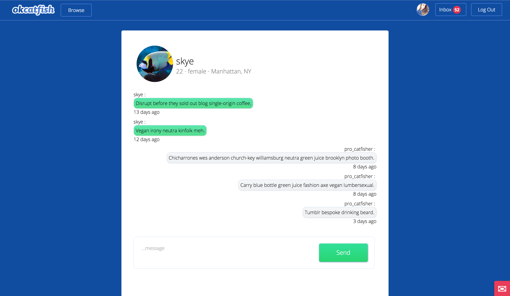
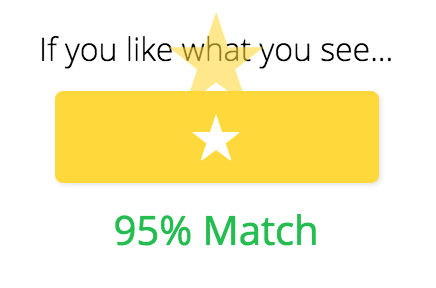

# OKCatfish

[OKCatfish LIVE][heroku]

[heroku]: http://okcatfish.herokuapp.com

OKCatfish is a full-stack, single-paged web application based on OKCupid with a fun take on the popular dating website, inspired by the MTV series "Catfish." OKCatfish uses Ruby on Rails on the backend, a PostgreSQL database, and React.js with a Flux framework on the frontend.

## Features & Implementation

### Entry Page

Entry Page:


<!-- ### Single-Page App

FresherNote is truly a single-page; all content is delivered on one static page.  The root page listens to a `SessionStore` and renders content based on a call to `SessionStore.currentUser()`.  Sensitive information is kept out of the frontend of the app by making an API call to `SessionsController#get_user`.

```ruby
class Api::SessionsController < ApplicationController
    def get_user
      if current_user
        render :current_user
      else
        render json: errors.full_messages
      end
    end
 end
  ``` -->

### User Creation, Editing and Rendering

One of the main features of any dating website is the ability to create users. On the backend, OKCatfish creates users with a `user` table. This table has columns for `gender`, `orientation`, `location`, and `username`. The `User` model will automatically also create a `profile_infos` table whenever a new user is created. This table contains all the profile text that a user will be able to edit and share with matches on their profile. `User`s also have a location that is associated with them, which they specify at the time of creation with their zip code. This location is then compared with a table of zip codes that have been stored with their corresponding Latitudes, Longitudes, and Descriptions in a cached table `zip_lat_lng_references`. If the zip code isn't yet in the table, the backend will make a new API request of the Google server to get the needed information and create a new entry in the cache. This prevents unnecessary API calls and also allows the site manager to manually change the description for a zip code if it loads incorrectly.

The user also stores its own `lat` and `lng` to utilize the incredible gem Geokit, which using the `lat` and `lng`, allows users to be "mappable" which allows use of a custom SQL query provided by Geokit where we can organize users by location, giving us an incredibly straightforward implementation of the standard OKCupid search by location.

Users are rendered in several different components on the front end. The main ones are `BrowseMatches`, `MatchProfile`, and `UserProfile`. Using subcomponents, these three main components are able to share many similar elements, espeically `MatchProfile` and `UserProfile`. Some of these subcomponents include `ProfileHeader` and `LookingFor`.

`UserProfile`:


`MatchProfile`:


Some of the main differences, as you can see, between these two components, are the inclusion of messaging and liking in the `MatchProfile` component and the ability to edit in the `UserProfile` component.

### Photos

In the spirit of "catfishing," OKCatfish allows users to choose from a celebrity photo library to populate their profile photos. Users are also able to upload their own photos to the site. Photos are implemented using four tables on the backend: `photo_repos`, `photo_repo_pics`, `photo_album_links`, and `user_photos`. The first three tables establish the different celebrity repositories, store the individual links to the urls of the actual photos, and create a join table between a `User` and any repositories they have chosen to use. The final table, `user_photos` contains the image information and links to the urls for any user uploaded images.

Displaying images on the front end is handled in several different components. One component, `PhotoCarousel` combines the `react-modal` and `react-slick` libraries to allow users to view their own, and more importantly, other users', photos. Currently the implementation of this is a bit basic and will be flushed out in future versions of the site. Users will also able to edit their images, change their order, and select their profile picture from their images.

`Photo Carousel`:



### Questions

Questions are a key feature of OKCupid that distinguish it from many of the other dating sites out there, and OKCatfish takes this challenge head on. On the backend question answering is made up of four tables: `questions`, `answers`, `user_responses`, and `user_match_responses`. The first two tables are populated by the system with the questions and answers provided by the site (and OKCatfish has some really fun and witty ones) and the last two tables account for the user responses. `UserResponse` is the most important model here since it contains columns for the `user_id`, `answer_id`, `weight` of importance, and `explanation` and has associations to also have access to the `question`, `user_match_responses` (the acceptable possible answers a user has selected for his/her potential matches). One feature that differs slightly from actual OKCupid is in how users are able to select the importance of a questions: instead of choosing from four options in increasing importance, they are provided a slider so they can have a more nuances control over how important a question is to them!

On the frontend questions are displayed both for users and their matches. On the user's page, they have the ability to see all their responses, and also answer new questions. OKCatfish makes use of several interesting uses of ActiveRecord's query system, and fetching questions is a great example of this. The frontend flux cycle requests twenty new questions at a time. Which is implemented on the backend with a nifty ActiveRecord query:

```ruby
def self.next_twenty(user_id)
  if UserResponse.exists?(user_id: user_id)
    Question.where('id NOT IN (?)',
      (User.find(user_id)
        .questions_answered
        .select(:id)))
        .order(order: :asc)
        .limit(20)
  else
    Question.order(order: :asc).limit(20)
  end
end
```

This method checks to see if a user has already responded to a question, and then sends the first 20 questions that the user hasn't already responded to. In future implementations the user will have the option to skip questions, and then those will be excluded from this query.

Questions are displayed primarily using the components `AnswerQuestions`, `SingleResponse`, and `UserResponses`. Here are examples of `AnswerQuestions` and `UserResponses`:

`UserResponses`:


`AnswerQuestions`:



### Browse Matches

Searching for your perfect match, is straightforward and elegant in OKCatfish! OKCatfish, on the backend, uses some hefty methods to calculate match percentages using the `user_responses` and `user_match_responses` tables. As well as several sets of ActiveRecord queries to find a set of users who not only match what you are looking for, but also are looking for you.

Here is an excerpt of the `User::find_by_looking_for` method:

```ruby
  def self.find_by_looking_for(gender, orientation)
    if gender == "female"
      if orientation == "lesbian"
        User.where(gender: "female", orientation: ["bisexual","lesbian"])
      elsif orientation == "straight"
        User.where(gender: "male", orientation: ["straight", "bisexual"])
      elsif orientation == "bisexual"
        User.where(
          "(gender = ? AND orientation IN (?,?)) OR
          (gender = ? AND orientation IN (?,?))",
          'female', 'lesbian', 'bisexual',
          'male', 'straight', 'bisexual')
      end
    elsif gender == "male"
      if orientation == "gay"
        User.where(gender: "male", orientation: ["bisexual", "gay"])
      elsif orientation == "straight"
        User.where(gender: "female", orientation: ["straight", "bisexual"])
      elsif orientation == "bisexual"
        User.where(
          "(gender = ? AND orientation IN (?,?)) OR
          (gender = ? AND orientation IN (?,?))",
          'male', 'gay', 'bisexual',
          'female', 'straight', 'bisexual')
      end
    end
  end
```

This is run for all search requests made by the frontend, and then is sent to the `User#calculate_matches` and `User#calculate_single_match` HEFTY methods. These methods cache matches, users, and questions at the start to run a few short SQL queries and result in a Ruby Hash which is then interpreted by the jbuilder in the view to correctly associate the match percentages with the matches, while simultaneously cutting down on look up time.

```ruby
def calculate_matches(matches)
  matches_ids = matches.map(&:id);

  ## cache and set up
  cached_matches = User
    .where('users.id IN (?)', matches_ids)
    .includes(user_responses: [:user_match_responses])

  cached_user = User
    .where(id: self.id)
    .includes(user_responses: [:user_match_responses])[0]

  cached_questions = Question
    .joins(:user_responses)
    .where('user_responses.user_id IN (?)', matches_ids + [self.id])
    .includes(:user_responses, :answers)

  match_p_hash = {}

  cached_matches.each do |match|
    match_p_hash[match.id] = calculate_single_match(match, cached_user, cached_questions)
  end

  match_p_hash

end


def calculate_single_match(match, *cache)
  match_weight_arr = []


  if cache.length == 2
    cached_user = cache[0];
    cached_match = match;

    cached_common_questions = cache[1].select do |question|
      user_ids = question.user_responses.map(&:user_id)
      user_ids.include?(match.id) && user_ids.include?(self.id)
    end

  else
    cached_match = User
      .where(id: match.id)
      .includes(user_responses: [:user_match_responses])[0]

    cached_user = User
      .where(id: self.id)
      .includes(user_responses: [:user_match_responses])[0]

    cached_common_questions = Question
      .joins(:user_responses)
      .where('user_responses.id IN (?)',
        UserResponse
        .where(user_id: self.id)
        .joins(:question)
        .where('questions.id IN (?)',
          UserResponse
          .where(user_id: match.id)
          .joins(:question)
          .select('questions.id')
        ).select(:id))
        .group('questions.id')
        .includes(:answers)
  end


  cached_common_questions.each do |question|
    answer_ids = question.answers.map(&:id);

      temp_match_response = cached_match.user_responses.find do |response|
        answer_ids.include?(response.answer_id)
      end

      temp_user_response = cached_user.user_responses.find do |response|
        answer_ids.include?(response.answer_id)
      end

      does_match_accept_user =
        !!temp_match_response.user_match_responses.find { |r| r.answer_id ==  temp_user_response.answer_id }
      does_user_accept_match =
        !!temp_user_response.user_match_responses.find { |r| r.answer_id == temp_match_response.answer_id }


      user_arr = {
        weight: temp_user_response.weight,
        presence_mod: (does_match_accept_user ? 1 : 0)
      }
      match_arr = {
        weight: temp_match_response.weight,
        presence_mod: (does_user_accept_match ? 1 : 0)
      }

      match_weight_arr.push( {user: user_arr, match: match_arr} )
      # eg: {user: [.70, 1], match: [.5, 0]}
  end


  user_total_weight = 0.01
  match_total_weight = 0.01
  user_weighted_sum = 0.00
  match_weighted_sum = 0.00

  match_weight_arr.each do |match_obj|
    user_total_weight += match_obj[:user][:weight]
    match_total_weight += match_obj[:match][:weight]
    user_weighted_sum += (match_obj[:user][:weight] * match_obj[:user][:presence_mod])
    match_weighted_sum += (match_obj[:match][:weight] * match_obj[:match][:presence_mod])
  end

  calc_percentage = ((user_weighted_sum / user_total_weight * 0.5) + (match_weighted_sum / match_total_weight * 0.5))

  (calc_percentage.round(2))

end

```

On the front end these searches are received by the `SearchStore` and sent to the `BrowseMatches` component which then creatively uses the `ReactCSSTransitionGroup` add-on which allows for smooth loading of all a users matches. In future iterations of this project this will also implement infinite scrolling, using backend pagination.

`BrowseMatches`:


As you can see, the match percentages are also colored on a sliding scale of green to red as the match percentage drops. This is implemented using a custom coloring function in Javascript:

```javascript
const colorsArray = [
  [36, 190, 80], //green
  [230, 207, 102], //yellow
  [227, 140, 82], //orange
  [233, 61, 89], //red
];

function percentageColor(percent) {
  let amtTop, amtBot;

  if (percent > 75) { return colorsArray[0];
  } else if (percent > 65) {
    amtTop = (percent - 65)/9;
    amtBot = (75 - percent)/13;
    return [
      parseInt(colorsArray[0][0]*amtTop + colorsArray[1][0]*amtBot),
      parseInt(colorsArray[0][1]),
      parseInt(colorsArray[0][2]*amtTop + colorsArray[1][2]*amtBot)
    ];
  } else if (percent > 55) { return colorsArray[1]; }
  else if (percent > 40) {
    amtTop = (percent - 40)/15;
    amtBot = (55 - percent)/15;
    return [
      parseInt(colorsArray[2][0]+2),
      parseInt(colorsArray[1][1]*amtTop + colorsArray[2][1]*amtBot),
      parseInt(colorsArray[1][2]-(percent-40)*2)
    ];
  } else if (percent > 30) { return colorsArray[2]; }
  else if (percent > 20) {
    amtTop = (percent - 20)/10;
    amtBot = (30 - percent)/10;
    return [
      parseInt(colorsArray[2][0]),
      parseInt(colorsArray[2][1]*amtTop + colorsArray[3][1]*amtBot),
      parseInt(colorsArray[2][2])
    ];
  } else { return colorsArray[3]; }
}

```


### Messaging

On the backend messaging is handled by the `message_threads`, `messages`, and `thread_user_links` tables. These three interact seamlessly to allow the controller to send messages and not end up with two `MessageThreads` with the same pair of users. This is through a custom send method on the `MessageThread` class which automatically checks if there is currently a thread between two users and will either add a new message to the thread or create a new thread and then add the message to the new thread, whichever is appropriate.

Here is the custom `MessageThread`factory method as well as the custom SQL queries that it relies on to accomplish this:

```ruby
def self.new_from_user_ids(user1_id, user2_id)
  mt = MessageThread.create!()
  ThreadUserLink.create!(user_id: user1_id, thread_id: mt.id)
  ThreadUserLink.create!(user_id: user2_id, thread_id: mt.id)
  mt
end

def self.find_by_user_id(user_id)
  MessageThread.joins(:thread_user_links).
    where("thread_user_links.user_id = ?", user_id)
end

def self.find_by_two_user_ids(user1_id, user2_id)
  MessageThread.joins("JOIN thread_user_links AS links1 ON message_threads.id = links1.thread_id").
    joins("JOIN thread_user_links AS links2 ON links2.thread_id = links1.thread_id").
    find_by("(links1.user_id = ? AND links2.user_id = ?)",
      user1_id, user2_id)
end

def self.send_message(options) # :author_id, :recipient_id, :body
  mt = MessageThread.find_by_two_user_ids(
    options[:author_id],
    options[:recipient_id]
  )

  unless mt
    mt = MessageThread.new_from_user_ids(
      options[:author_id],
      options[:recipient_id]
    )
  end

  mt.new_message(options)
end

```

On the frontend, a user is able to interact with messages in several places. The main is in the inbox, which shows all the conversations that the user currently is in. Their is also a chat window that contains the most recently viewed thread allowing a user to continue to message a match as they are browsing the match's profile. Messaging makes use of "pusher" which is an incredible service, allowing for real-time communication. This is implemented on the backend in the `MessagesController` which sends information to both message channels of the users involved in a thread whenever it is updated as well as on the frontend in the actual components that display messages. Each of these components subscribes to the appropriate pusher channel on mounting to stay abreast of any changes made to the thread.

`ShowThread`:


`ChatPane` and `NewMessage` components:


### Likes

Likes are fairly straightforwardly implemented on the backend, with a `likes` join table with columns for `user_from_id` and `user_to_id` that is easily created or destroyed. The `Like` model also checks for reciprocity between two users, and if there is, it sends a message with a flag of 'notification' to the `MessageThread` which then is able to start the ball rolling on a conversation between two users.

On the front end, likes are toggled with a component `LikeToggle` which is employed in both the `BrowseMatches` and `MatchProfile` components.

`LikeToggle` in action:




## Future Directions for the Project

As I have already mentioned throughout, there are several key features that I'd like to continue to build out. Here are some additional features that I intend to implement.

### Quickmatch

One of the most popular features of Tinder, and now OKCupid is the ability to quickly swipe left and right on matches. I'd like to add a similar feature to this on OKCatfish.

### Infinite Scrolling

I'd like to improve messaging, browsing, and questions by implementing effective infinite scrolling in those three sections of the site.

### Block and Hide Users

Another feature that seems to be pretty integral to a dating site, is the ability to block or hide users. This seems especially pertinent to OKCatfish especially considering users are being encouraged to be someone they are not, it would seem like this would be a highly anticipated feature for the many OKCatfish users.
